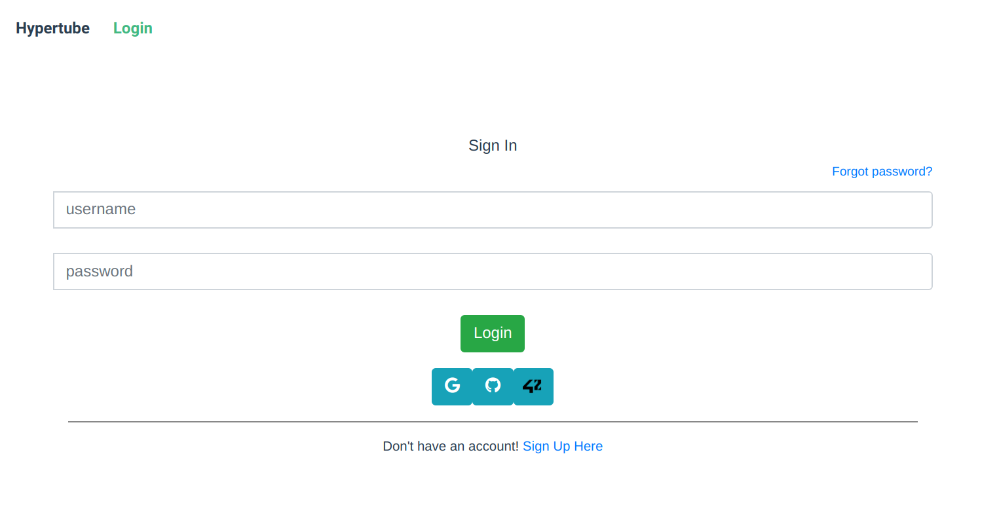
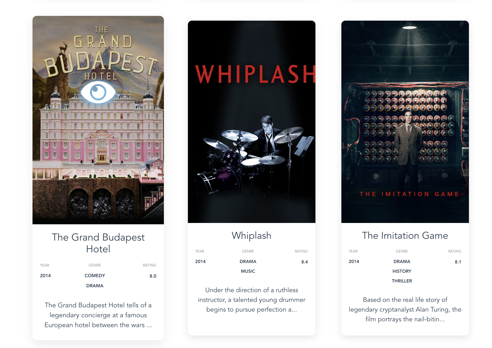

# Hypertube
###### Ecole 42 - Final project of the web branch

A collaborative project with the objective of creating a video streaming web application using the BitTorrent protocol.

## Getting Started

Follow the instructions to get a copy of the project and run it on your local machine for development and testing purposes.

### Prerequisites

```
Docker
```

#### Before Installing: OmniAuth (Optional)
- To use the _Github_ and _Google_ OmniAuth authentication system, add the app credentials in _back/app/scripts/start.py_

- To use the _42_ OmniAuth authentication system, add the app credentials in _back/app/back/settings.py_ (`ID_42` and `SECRET_42`) and in _front/app/src/views/Login.vue_ (`client_id`)

### Installion
```
git clone https://github.com/Seren4/hypertube.git
cd hypertube
docker-compose up --build
```

### Database setup
- To fill the database, go to http://localhost:8080/ and click  *Start task*.
Now you can navigate to http://localhost:3000 and register.
- The registration confirmation email will be sent to the console where you launched the project. Click on the link to confirm the registration and log in.

## Features

### User Authentication
- JSON Web Tokens authorization system
- User registration with email address, username, last name, first name, photo and password
- Github, Google and 42 OmniAuth authentication systems
- Regular login with username and password
- Forgotten password reset via email


### User Area
- General informations, email, password and profile picture editing


### Movie Library
- Accessible only to connected users
- A thumbnails list of the most popular movies, with a distinction between seen and unseen movies
- Infinite scroll
- Sorting: Title, Year or Rating
- Searching/Filtering: Title, Genre, Year range and Rating range





### Movie page - Video player
- Movie details: summary, casting, production year, length, language, rates, poster...
- Comment section, with user info and pop-up profile  
- English and French subtitles available
- Once started the player, if not already in the database, the movie is downloaded from the associated torrents and made available once the initial 5% is available, to ensure uninterrupted viewing
- If a movie has not been watched for a month, it will be automatically deleted


### Mobile Version


## Built with

* [Vuejs](https://vuejs.org/) + [Vuex](https://vuex.vuejs.org/)
* [Django](https://www.djangoproject.com/)
* [Django Rest Framework](https://www.django-rest-framework.org/)
* [Go](https://golang.org/)
* [Flask](https://flask.palletsprojects.com/en/1.0.x/)
* [Docker](https://www.docker.com/)
* [MySQL](https://www.mysql.com/)
* [Bootstrap](https://getbootstrap.com/)

## External API
- [Popcorn Time](https://popcorntime.api-docs.io/api/welcome/introduction)
- [ The Movie Database (TMDb)](https://developers.themoviedb.org/3/getting-started/introduction)
- [The Open Movie Database](http://www.omdbapi.com/)

## Authors

* **Serena Ciliberti** - [Seren4](https://github.com/Seren4)
* **Giovanni Ruocco** - [J0oR](https://github.com/J0oR)
* **Maxime Connat** - [mconnat](https://github.com/mconnat)
